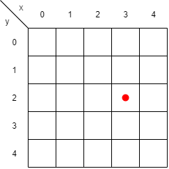

# IA-JuegoOSO
 > Algoritmo Minimax aplicado al juego de OSO

## Table of contents
* [Información General](#información-general)
  * [Juego OSO](#juego-oso)
  * [Minimax](#minimax)
* [Technologies](#technologies)
* [Instalación](#instalación)
* [Uso](#uso)
  * [Ejecución del programa y sus alternativas](#ejecución-del-programa-y-sus-alternativas)
  * [Jugar contra la computadora](#jugar-contra-la-computadora)
  * [Otros métodos de interés](#otros-métodos-de-interés)
* [Features](#features)
* [Estado del proyecto](#estado-del-proyecto)
* [Inspiration](#inspiration)
* [Contact](#contact)

## Información General
El proyecto de este repositorio aplica minimax para jugar una ronda de OSO. El juego se juega entre el usuario y la computadora. La computadora determina sus movimentos basados en el algoritmo minimax. 

### Juego OSO
OSO es un juego donde el objetivo es formar la palabra OSO en un tablero cuadrado (tambien conocido como SOS en inglés). Se juega de dos jugadores y cada uno puede poner la letra "O" o "S" en una posición, que no ya tiene una letra asignada, durante su turno. Si la letra que se puso forma la palabra OSO vertical, horizontal o diagonalmente entonces el jugador gana un punto por cada instancia de la palabra formada. 

### Minimax
Minimax es un algoritmo para determinar la mejor acción considerando los movimientos futuros que pueden hacer los dos jugadores. El algoritmo minimax asigna un valor a cada movimientoº . Un valor bajo significa conveniente para el oponente y vice versa. En base a esos números encuentra los siguientes D movimientos posibles y, pensando que los jugadores siempre hacen el mejor movimiento posible, determina la mejor acción que puede tomar (la que tiene el mejor valor). El valor de D tambien se refiere a la profundidad. El siguiente diagrama demuestra cómo funciona el algoritmo minimax en un juego de gato.

DIAGRAMA DE GATO

## Technologies
* Tech 1 - version 1.0
* Tech 2 - version 2.0
* Tech 3 - version 3.0

## Instalación
Primero hay que descargar SWI-Prolog en la [página](https://www.swi-prolog.org/download/stable) de SWI-Prolog. También se puede correr en cualquier aplicación que soporta ejecución del lenguaje de programación Prolog. Aquí vamos a considerar que se esta utilizando SWI-Prolog para correr el programa. Además, hay que descargar el archivo Proyecto2.pl en el directorio deseado.

Ya en la aplicación de SWI-Prolog para abrir el programa hay que selecionar File -> Consult y en la ventana que se abre hay que encontrar y selecionar el archivo Proyecto2.pl. Con eso se abrió el programa y en la siguiente sección puede ver cómo utilizarlo.

IMAGEN DE PROLOG FILE CONSULT

## Uso
El programa tiene muchos métodos pero aquí solo vamos a ver los principales para ejecutarlo. Es importante notar que en Prolog cada instucción debe terminar con un punto.

### Ejecución del programa y sus alternativas

* `gameOSO().` Este comando se utiliza para iniciar el juego con un tablero de 5x5 con una profundidad de 3 para el algoritmo.

* `gameOSO(D).` Este comando se utiliza para iniciar el juego con un tablero de 5x5 con una profundidad de D para el algoritmo.

* `gameOSOred().` Este comando se utiliza para iniciar el juego con un tablero de 3x3 con una profundidad de 3 para el algoritmo.

* `gameOSOred(D).` Este comando se utiliza para iniciar el juego con un tablero de 3x3 con el algoritmo viendo D movimientos al futuro.

* `gameOSOvar(D,N).` Este comando se utiliza para iniciar el juego con un tablero de NxN con el algoritmo viendo D movimientos al futuro.

### Jugar contra la computadora
Después de ejecutar el comando de inicio el programa va a preguntar quién empieza el juego. Aqui simplemente hay que responder con `1.` o `2.`. Ahora que ya empieza el juego hay que mencionar que la computadora se puede tardar un rato en realizar su movimiento, dependiendo de cómo se inicializó el juego. Esto es por la alta cantidad de futuros que esta considerando en sus cálculos. 

Para realizar un movimiento la computadora va a pedir por una lista de la forma `[X,Y,L].` donde X representa la *coordenada x*, Y la *coordenada y* y L la *letra* que se quiere meter. Es imporante notar que las letras deben ser minúsculas porque las mayúsculas representan variables. La imagen 1 presenta cómo hay que ver las coordenadas. Por ejemplo, si se quiere poner la letra "o" en la posición con el punto rojo hay que ingresar `[3,2,o]`.

Imagen 1: Tablero 5x5

Al final del juego hay que terminar el programa. El proyecto no sabe cuándo acaba el juego y por eso hay que terminar el proceso manualmente. Esto se puede hacer precionando `CTRL+C` -> `A` -> `ENTER`.

### Otros métodos de interés

## Estado del proyecto
El project está: _finished_ pero hay unas mejoras que se puden hacer al código.

## Inspiration
Add here credits. Project inspired by..., based on...

## Contact
Created by [@flynerdpl](https://www.flynerd.pl/) - feel free to contact me!
