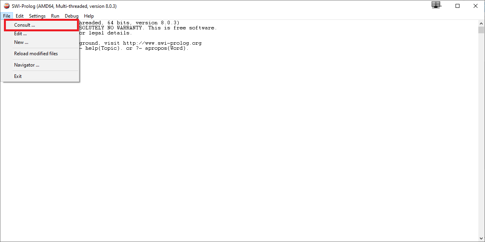

# IA-JuegoOSO
 > Algoritmo Minimax aplicado al juego de OSO

## Tabla de contenido
* [Información General](#información-general)
  * [Juego OSO](#juego-oso)
  * [Minimax](#minimax)
* [Instalación](#instalación)
* [Uso](#uso)
  * [Ejecución del programa y sus alternativas](#ejecución-del-programa-y-sus-alternativas)
  * [Jugar contra la computadora](#jugar-contra-la-computadora)
* [Estado del proyecto](#estado-del-proyecto)
* [Contacto](#contacto)

## Información General
El proyecto de este repositorio aplica minimax para jugar una ronda de OSO. El juego se lleva a cabo entre el usuario y la computadora. La máquina determina sus movimientos basados en el algoritmo minimax. 

### Juego OSO
OSO es un juego donde el objetivo es formar la palabra OSO en un tablero cuadrado (también conocido como SOS en inglés). Los jugadores son dos y cada uno puede poner la letra "O" o "S" en una posición, que no tenga una letra asignada, durante su turno. Si la letra que se puso forma la palabra OSO vertical, horizontal o diagonalmente, entonces el jugador gana un punto por cada instancia de la palabra formada. 

### Minimax
Minimax es un algoritmo para determinar la mejor acción considerando los movimientos futuros que pueden hacer los dos jugadores. El algoritmo minimax asigna un valor a cada movimiento, dependiendo si es una jugada buena o mala. En base a esos números encuentra los siguientes D movimientos posibles y, pensando que los jugadores siempre hacen el mejor movimiento posible, determina la mejor acción que puede tomar (la que tiene el mejor valor). El valor de D también se refiere a la profundidad. El Diagrama 1 demuestra cómo funciona el algoritmo minimax aplicado en un juego de gato.

Diagrama 1: Ejemplo de Minimax (Gato)

## Instalación
Primero tienes que descargar SWI-Prolog en la [página](https://www.swi-prolog.org/download/stable) de SWI-Prolog. También puedes correrlo en cualquier aplicación que soporte ejecución del lenguaje de programación Prolog. Aquí vamos a considerar que se está utilizando SWI-Prolog para correr el programa. Además, tienes que descargar el archivo `Proyecto2.pl`.

Ya en la aplicación de SWI-Prolog, para abrir el programa, tienes que seleccionar File -> Consult (ver Imagen 1) y en la ventana que se abre tienes que encontrar y seleccionar el archivo `Proyecto2.pl`. De esta forma abriste el programa y en la siguiente sección ([Uso](#uso)) puedes ver cómo utilizarlo.

Imagen 1: Lugar para abrir el programa en SWI-Prolog

## Uso
El programa tiene muchos métodos, pero aquí solo vamos a ver los principales para ejecutarlo. Es importante notar que en Prolog cada instrucción debe terminar con un punto.

### Ejecución del programa y sus alternativas

* `gameOSO().` Este comando utilizas para iniciar el juego con un tablero de 5x5 con una profundidad de 3 para el algoritmo.

* `gameOSO(D).` Este comando utilizas para iniciar el juego con un tablero de 5x5 con una profundidad de D para el algoritmo.

* `gameOSOred().` Este comando utilizas para iniciar el juego con un tablero de 3x3 con una profundidad de 3 para el algoritmo.

* `gameOSOred(D).` Este comando utilizas para iniciar el juego con un tablero de 3x3 con el algoritmo viendo D movimientos al futuro.

* `gameOSOvar(D,N).` Este comando utilizas para iniciar el juego con un tablero de NxN con el algoritmo viendo D movimientos al futuro.

### Jugar contra la computadora
Después de ejecutar el comando de inicio el programa solicitará quién empieza el juego. Aquí simplemente tienes que responder con `1.` o `2.`. Ahora que ya empezó el juego hay que mencionar que la computadora se puede tardar un rato en realizar su movimiento, dependiendo de cómo inicializaste el juego. Esto es por la alta cantidad de futuros movimientos que está considerando en sus cálculos. 

Para realizar un movimiento la computadora va a pedir por una lista de la forma `[X,Y,L].` donde X representa la ***coordenada x***, Y la ***coordenada y*** y L la ***letra***. Es importante notar que las letras deben ser minúsculas porque las mayúsculas representan variables. En la Imagen 2 observas cómo hay que ver las coordenadas. Por ejemplo, si quieres poner la letra "o" en la posición con el punto rojo tienes que ingresar `[3,2,o]`.

Imagen 2: Tablero 5x5

Al final del juego tienes que terminar el programa. El proyecto no sabe cuándo acaba el juego y por eso hay que terminar el proceso manualmente. Esto puedes hacer pulsando `CTRL+C` -> `A` -> `ENTER`.

## Estado del proyecto
El proyecto está: _Terminado_ pero hay unas mejoras que se pueden hacer al código.

## Contacto
Creado por [@FranGonRic](https://github.com/FranGonRic). Para preguntas: frangonzarico@gmail.com
