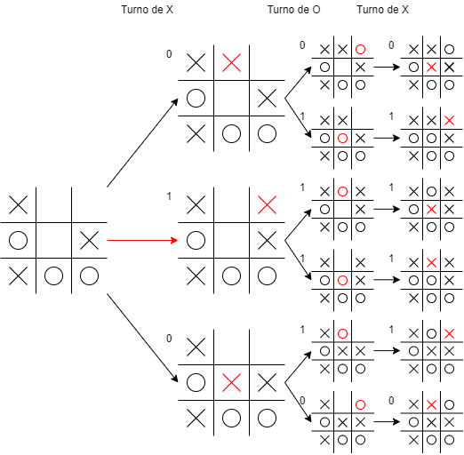
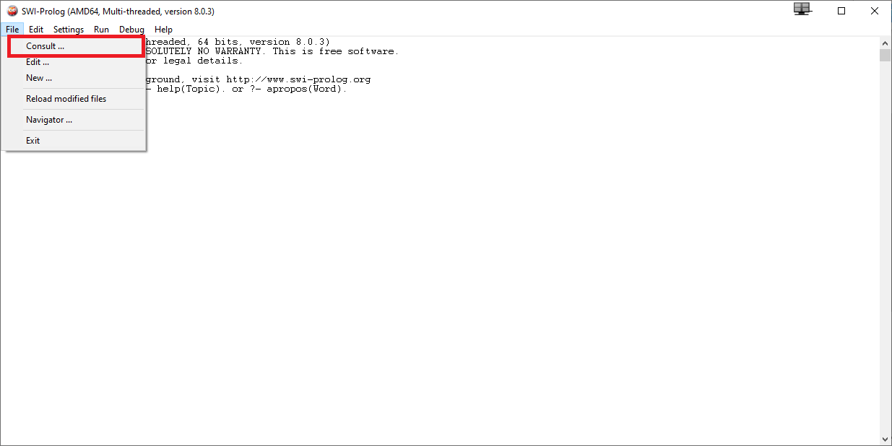

# IA-JuegoOSO
 > Algoritmo Minimax aplicado al juego de OSO
 
## Descripción de proyecto
Este proyecto aplica minimax para jugar una ronda de OSO. El juego se lleva a cabo entre el usuario y la computadora. La máquina determina sus movimientos basados en el algoritmo minimax. 

## Tabla de contenido
* [Información General](#información-general)
  * [Juego OSO](#juego-oso)
  * [Minimax](#minimax)
* [Instalación](#instalación)
* [Uso](#uso)
  * [Ejecución del programa y sus alternativas](#ejecución-del-programa-y-sus-alternativas)
  * [Jugar contra la computadora](#jugar-contra-la-computadora)
* [Estado del proyecto](#estado-del-proyecto)
* [Contacto](#contacto)

## Información General

### Juego OSO
OSO es un juego cuyo objetivo es formar la palabra OSO en un tablero cuadrado. También es conocido como SOS en inglés. Los jugadores son dos y cada uno puede poner la letra "O" o "S" en una posición durante su turno. Dicha posición no debe tener una letra asignada. Si la letra puesta forma la palabra OSO vertical, horizontal o diagonalmente, entonces el jugador gana un punto por cada palabra formada. 

### Minimax
Minimax es un algoritmo para determinar la mejor acción considerando los movimientos futuros que pueden hacer los dos jugadores. El algoritmo minimax asigna un valor a cada movimiento, dependiendo si es una jugada buena o mala. Con base en esos números encuentra los siguientes D movimientos posibles. Pensando que los jugadores siempre hacen el mejor movimiento posible, determina la mejor acción que puede tomar. El valor de D también se refiere a la profundidad. El siguiente diagrama demuestra cómo funciona el algoritmo minimax aplicado en un juego de gato:

## Instalación
Primero tienes que descargar SWI-Prolog en la [página](https://www.swi-prolog.org/download/stable) de SWI-Prolog. También puedes ejecutarlo en cualquier aplicación que soporte ejecución del lenguaje de programación Prolog. Aquí se está considerando que estás utilizando SWI-Prolog para ejecutar el programa. Además, tienes que descargar el archivo `Proyecto2.pl`.

Ya en la aplicación de SWI-Prolog, para abrir el programa, tienes que seleccionar File -> Consult. En la ventana que se abre tienes que encontrar y seleccionar el archivo `Proyecto2.pl`. De esta forma abriste el programa. En la siguiente imagen puedes ver en dónde se encuentra el Consult:

## Uso
El programa tiene muchos métodos, pero aquí solo se van a ver los principales para ejecutarlo. Es importante notar que en Prolog cada instrucción debe terminar con un punto.

### Ejecución del programa y sus alternativas

El comando-

* `gameOSO().` inicia el juego con un tablero de 5x5 con una profundidad de 3 para el algoritmo.

* `gameOSO(D).` inicia el juego con un tablero de 5x5 con una profundidad de D para el algoritmo.

* `gameOSOred().` inicia el juego con un tablero de 3x3 con una profundidad de 3 para el algoritmo.

* `gameOSOred(D).` inicia el juego con un tablero de 3x3 con una profundidad de D para el algoritmo.

* `gameOSOvar(D,N).` inicia el juego con un tablero de NxN con una profundidad de D para el algoritmo.

### Jugar contra la computadora
Después de que ejecutes el comando de inicio el programa solicitará quién empieza el juego. Aquí simplemente tienes que responder con `1.` o `2.`. La computadora se puede tardar en realizar su movimiento, dependiendo de cómo inicializaste el juego. Este retraso es por la alta cantidad de futuros movimientos que está considerando en sus cálculos. 

Para realizar un movimiento la computadora pedirá una lista de la forma `[X,Y,L].`. X representa la ***coordenada x***, Y la ***coordenada y*** y L la ***letra***. Es importante notar que las letras deben ser minúsculas porque las mayúsculas representan variables. En la siguiente imagen puedes observar cómo hay que ver las coordenadas. Por ejemplo, si quieres poner la letra "o" en la posición con el punto rojo tienes que ingresar `[3,2,o]`.

Al final del juego tienes que terminar el programa. El proyecto no sabe cuándo acaba el juego y por eso hay que terminar el proceso manualmente. Esto puedes hacerlo pulsando `CTRL+C` -> `A` -> `ENTER`.

## Estado del proyecto
El proyecto está: _Terminado_ pero hay unas mejoras que se pueden hacer al código.

## Contacto
Creado por [@FranGonRic](https://github.com/FranGonRic). Para preguntas: frangonzarico@gmail.com
